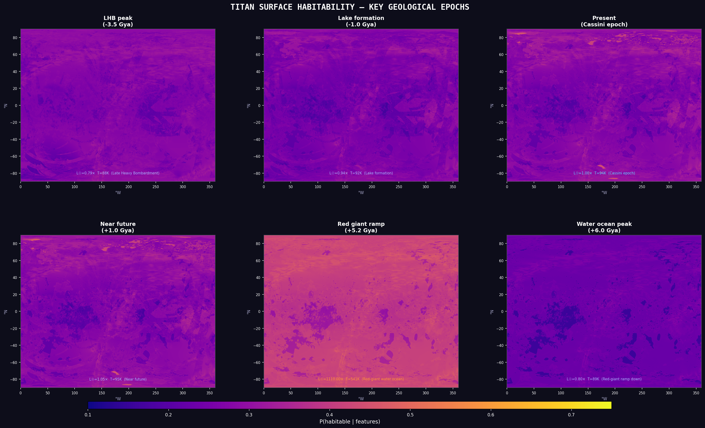
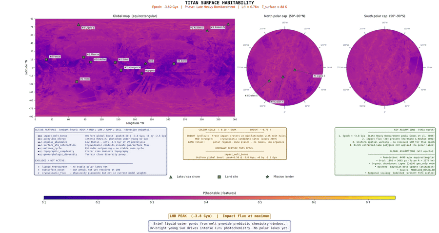

# Bayesian Surface Habitability Mapping of Titan

**Spatially resolved, multi-epoch habitability assessment of Saturn's moon Titan using Cassini observational data and Bayesian inference.**

This repository contains the complete data-processing pipeline, Bayesian inference framework, temporal reconstruction code, and figure-generation scripts for the MPhil thesis:

> C. Meadows (2026). *Bayesian Surface Habitability Mapping of Titan*.
> MPhil in Planetary Science and Life in the Universe, University of Cambridge.
> Contact: [cm10004@cam.ac.uk](mailto:cm10004@cam.ac.uk)

The thesis document is not included in this repository. Please contact the author for a copy.

---

## Overview

This pipeline produces global posterior-probability habitability maps of Titan at 4,490 m/px resolution (1802 × 3603 pixels, 6.49 million pixels per epoch) across five anchor epochs spanning −3.8 to +6.5 Gya — from the Late Heavy Bombardment through the present Cassini era to a future red-giant ocean phase.

Eight habitability-proxy features are extracted from Cassini SAR, VIMS, CIRS, altimetry, geomorphological classification, fluvial channel mapping, gravity, and crater catalogue data. A Beta-conjugate Bayesian framework combines these features into a posterior habitability probability $P(H \mid \mathbf{f})$ at every pixel, with closed-form 95% credible intervals.

### Key findings

- **Towada Lacus** (244°W, 71°N) ranks #1 at four of five epochs (Uvs Lacus leads in the Future), among a cluster of north-polar lacus with the highest VIMS-resolved organic abundance
- All top-10 sites are **lake or lacus margins** at every epoch
- The present-day habitability structure is a **plateau extending ≥250 Myr** into the future
- The Future red-giant ocean epoch (+5.9 Gya) produces the highest scores ($P(H)$ up to 0.71)
- **Selk crater** (the Dragonfly landing site) scores $P(H) = 0.21$ — below the prior mean but with the highest geomorphological diversity ($f_7 = 0.66$, 7.2× global median), consistent with Dragonfly targeting past water–organic chemistry rather than present-day solvent habitability

### Visualisations

The current posterior-probability maps for the five anchor epochs, plus red giant ramp down:



The full temporal animation (74 frames, −3.8 to +6.5 Gya). Click to download the MP4:

[](./titan_habitability_animation_full_inference.mp4)

---

## Repository Structure

```
titan_pipeline/
├── run_pipeline.py                  # Main entry point — runs all 5 stages
├── generate_temporal_maps.py        # Multi-epoch animation and PCHIP interpolation
├── requirements.txt                 # Python dependencies
├── INSTALL.md                       # Data acquisition and placement guide
├── ISSUES.md                        # Known issues and limitations
├── LICENSE.md                       # GNU GPL v3
│
├── configs/
│   ├── pipeline_config.py           # Grid, CRS, dataset specs, hyperparameters
│   └── temporal_config.py           # Epoch definitions and scale functions
│
├── titan/                           # Core library
│   ├── acquisition.py               # Stage 1: data download and verification
│   ├── preprocessing.py             # Stage 2: reproject to canonical grid
│   ├── features.py                  # Stage 3: eight habitability-proxy features
│   ├── temporal_features.py         # Stage 3b: epoch-specific feature transforms
│   ├── atmospheric_profiles.py      # CIRS/INMS atmospheric models
│   ├── visualisation.py             # Stage 5: figure generation
│   ├── bayesian/
│   │   ├── inference.py             # Stage 4: sklearn and analytical inference
│   │   └── temporal_inference.py    # Temporal-mode inference dispatcher
│   └── io/
│       ├── gtdr_reader.py           # PDS GTDR/GTIE elevation tile reader
│       ├── shapefile_rasteriser.py  # Lopes/Birch shapefile → raster
│       └── vims_reader.py           # VIMS footprint parquet reader
│       └── vims_cube_mosaic.py      # VIMS spectral cube mosaicking
│
├── scripts/                         # Standalone figure and analysis scripts
│   ├── analyse_location_habitability.py  # Site-specific habitability analysis
│   ├── generate_sensitivity_analysis.py  # Prior-parameter sensitivity (Fig. 4.1)
│   ├── generate_bayesian_diagram.py      # Bayesian update schematic (Fig. 2.3)
│   ├── generate_beta_update_figure.py    # Feature-by-feature update (Fig. B.1)
│   ├── generate_hdi_comparison.py        # CI comparison chart (Fig. 2.4)
│   ├── generate_feature_panel.py         # 8-panel feature map (Fig. A.1)
│   ├── generate_temporal_trend.py        # Median P(H) vs time (Fig. 3.7)
│   ├── generate_epoch_timeline.py        # Feature scale factors (Fig. 2.6)
│   ├── generate_seasonal_trend.py        # Seasonal P(H), Cassini window (Fig. I.1)
│   ├── generate_seasonal_periodic.py     # Periodic vs Jennings comparison (Fig. I.2)
│   ├── prototype_seasonal_ph.py          # Exploratory seasonal P(H) prototype
│   ├── prototype_f4_seasonal.py          # Exploratory f4 seasonal-driver check
│   └── diagnose/                         # Diagnostic and validation scripts
│
├── tests/                           # pytest test suite
│   ├── test_features_*.py           # Feature extraction unit tests
│   ├── test_preprocessing.py        # Reprojection and grid tests
│   └── test_new_temporal_modes.py   # Temporal mode and PCHIP tests
│
└── data/                            # Not tracked in git — see INSTALL.md
    ├── raw/                         # Original Cassini data products
    └── processed/                   # Canonical-grid rasters (generated)
```

---

## Requirements

- **Python**: 3.10–3.12 (3.11 recommended)
- **GDAL**: required for rasterio (`brew install gdal` on macOS)
- **Disk**: ~2 GB for raw data, ~1 GB for processed rasters, ~500 MB for outputs

Install Python dependencies:

```bash
pip install -r requirements.txt
```

See [INSTALL.md](INSTALL.md) for detailed data acquisition instructions, including download URLs for all 16 Cassini data products.

---

## Reproducing Results

### 1. Acquire data

Follow [INSTALL.md](INSTALL.md) to download and place the required Cassini data products in `data/raw/`. The minimum viable set is the two GTIE topography tiles; the full pipeline requires all 16 datasets.

### 2. Run the pipeline (all epochs)

```bash
python run_pipeline.py --temporal-mode past --overwrite
python run_pipeline.py --temporal-mode lake_formation --overwrite
python run_pipeline.py --temporal-mode present --overwrite
python run_pipeline.py --temporal-mode near_future --overwrite
python run_pipeline.py --temporal-mode future --overwrite
```

Or run all modes at once:

```bash
python run_pipeline.py --all-temporal-modes --overwrite
```

Each run produces:
- `outputs/<mode>/features/` — 8 feature maps as GeoTIFFs and a NetCDF stack
- `outputs/<mode>/inference/` — posterior maps (`posterior_analytical.npy`, `posterior_mean.npy`)
- `outputs/<mode>/figures/` — publication-ready PDF/PNG figures

### 3. Generate temporal animation

```bash
python generate_temporal_maps.py --inference-mode full_inference --save-posterior-npy
```

Produces 74-frame animation interpolating between the 5 anchor posteriors using PCHIP monotone cubic interpolation.

### 4. Generate thesis figures

```bash
python scripts/generate_sensitivity_analysis.py
python scripts/generate_bayesian_diagram.py
python scripts/generate_beta_update_figure.py
python scripts/generate_hdi_comparison.py
python scripts/generate_feature_panel.py
python scripts/generate_temporal_trend.py
python scripts/generate_seasonal_trend.py       # Appendix I, Fig. I.1
python scripts/generate_seasonal_periodic.py    # Appendix I, Fig. I.2
python scripts/analyse_location_habitability.py
```

### 5. Run tests

```bash
pytest tests/ -v
```

---

## Data Sources

All input data are derived from the Cassini–Huygens mission (2004–2017). The pipeline does not include the raw data files due to their size; see [INSTALL.md](INSTALL.md) for download instructions.

| Dataset | Source | Reference |
|---|---|---|
| SAR backscatter mosaic | [USGS Astropedia](https://astrogeology.usgs.gov/) | Le Gall et al. (2016) |
| VIMS+ISS 1.59/1.27 µm mosaic | [Caltech DATA](https://data.caltech.edu/) | Seignovert et al. (2019) |
| GTIE/GTDR topography | [Cornell](https://data.astro.cornell.edu/titan_topo_corlies/) | Corlies et al. (2017) |
| Geomorphological classification | [Mendeley Data](https://data.mendeley.com/) | Lopes et al. (2019) |
| Polar lake mapping | [Cornell](https://data.astro.cornell.edu/titan_polar_mapping_birch/) | Birch et al. (2017) |
| Fluvial channel map | [Cornell](https://data.astro.cornell.edu/titan_channels_miller/) | Miller et al. (2021) |
| Tidal Love number $k_2$ | Cassini gravity | Iess et al. (2012) |
| Crater catalogue | SAR-derived | Hedgepeth et al. (2020) |

---

## Pipeline Stages

| Stage | Description | Key module |
|---|---|---|
| 1. Acquisition | Download and verify 16 Cassini data products | `titan/acquisition.py` |
| 2. Preprocessing | Reproject all rasters to canonical 4490 m/px equirectangular grid | `titan/preprocessing.py` |
| 3. Feature extraction | Compute 8 habitability-proxy features ($f_1$–$f_8$) | `titan/features.py` |
| 4. Bayesian inference | Beta-conjugate posterior update at 6.49M pixels | `titan/bayesian/` |
| 5. Visualisation | Posterior maps, CI charts, feature panels | `titan/visualisation.py` |

---

## Bayesian Framework

The posterior habitability probability at each pixel is:

$$P(H \mid \mathbf{f}) = \frac{\alpha_0 + \lambda \sum_i w_i f_i}{\alpha_0 + \beta_0 + \lambda}$$

where:
- $\alpha_0 = \kappa \mu_0 = 1.655$, $\beta_0 = \kappa(1-\mu_0) = 3.345$ (prior shape parameters)
- $\kappa = 5$ (prior concentration), $\lambda = 6$ (likelihood sharpness)
- $\mu_0 = \sum_i w_i \mu_i = 0.331$ (global prior mean)
- $w_i$ = feature weights (sum to 1.0), $f_i$ = normalised feature values

The posterior at each pixel is a full Beta distribution with closed-form 95% credible intervals, not just a point estimate.

---

## Temporal Epochs

| Epoch | Time | Key characteristic |
|---|---|---|
| Past | −3.5 Gya | Late Heavy Bombardment; no polar lakes; impact-melt ponds |
| Lake Formation | −1.0 Gya | Polar lake system emerging; cryovolcanic outgassing |
| Present | 0.0 Gya | Cassini calibration epoch; all 8 features measured |
| Near Future | +0.25 Gya | Solar luminosity +2.5%; stable polar lakes |
| Future | +5.9 Gya | Red-giant water–ammonia ocean; peak habitability |

---

## Citation

If you use this code or data in your research, please cite:

```bibtex
@mastersthesis{Meadows2026TitanHabitability,
  author  = {Meadows, Chris},
  title   = {Bayesian Surface Habitability Mapping of {Titan}},
  school  = {University of Cambridge},
  year    = {2026},
  type    = {{MPhil} thesis},
  note    = {Department of Earth Sciences, Planetary Science and Life in the Universe programme},
}
```

This work builds on the Bayesian habitability assessment framework established by:

- Affholder, A. et al. (2021). Bayesian analysis of Enceladus's plume data to assess methanogenesis. *Nature Astronomy*, 5, 805–814. [doi:10.1038/s41550-021-01372-6](https://doi.org/10.1038/s41550-021-01372-6)
- Catling, D. C. et al. (2018). Exoplanet biosignatures: a framework for their assessment. *Astrobiology*, 18, 709–738. [doi:10.1089/ast.2017.1737](https://doi.org/10.1089/ast.2017.1737)

---

## License

This project is licensed under the **GNU General Public License v3.0** — see [LICENSE.md](LICENSE.md) for details.

Copyright © 2025–2026 Chris Meadows, University of Cambridge.

---

## Contact

Chris Meadows — cm one triple zero 4 @cam.ac.uk

Please read [INSTALL.md](INSTALL.md) for data setup and [ISSUES.md](ISSUES.md) for known limitations. Although this project references many research papers, they are not included here for copyright reasons.
